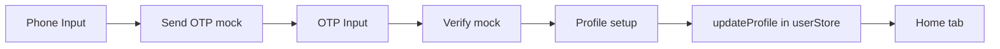
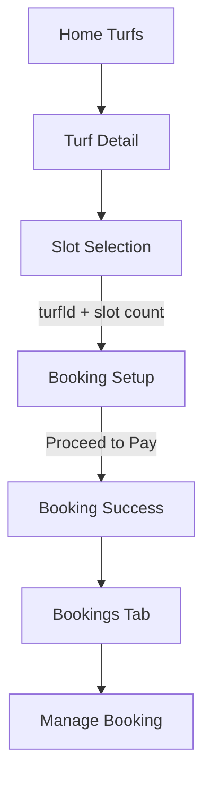
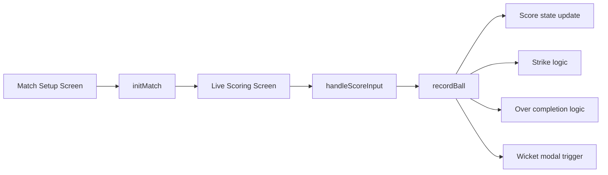
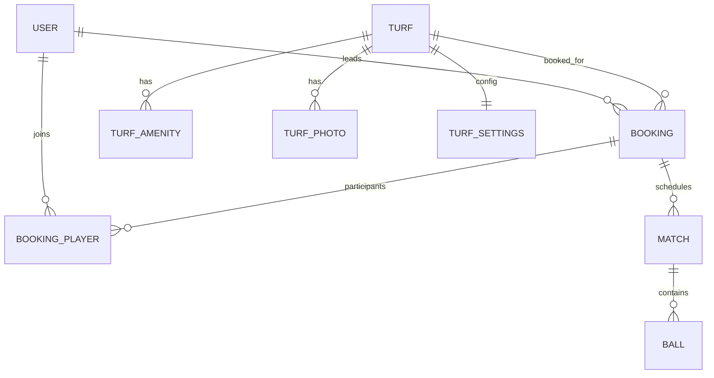

# BookTurf - Project Technical Documentation

Version: Generated on 2026-07-01  
Scope: Entire current codebase in this workspace  
Source of truth policy: This document is based only on implemented files and behavior present in source code.

## Table of Contents

1. Project Overview
2. Features
3. Application Flow
4. Screen Documentation
5. Project Structure
6. Routing Architecture
7. State Management
8. Component Inventory
9. Booking System
10. Tournament System
11. Scoring System
12. Models and Types
13. Services
14. API Documentation
15. Authentication
16. Theme and UI System
17. Hooks Documentation
18. Dependency Inventory
19. Performance and Architecture Review
20. Security Review
21. Known Issues and Technical Debt
22. Future Roadmap
23. Change Impact Map
24. Project Health Summary

---

## 1. Project Overview

### Project Name
- Package name: clickint
- Product name in app config: Turf4All
- Repository/workspace name: BookTurf

### What is BookTurf?
BookTurf is an Expo + React Native mobile application that provides:
- Turf discovery and turf detail exploration
- Booking slot selection and booking setup with dynamic pricing
- Booking management entry points
- Basic live cricket scoring workflow
- Mock authentication and profile setup

### Product Vision (as implemented)
Provide one app where local cricket groups can:
- Find a turf
- Reserve a slot
- Organize players
- Start a match and score live

### Problem Being Solved
The app addresses fragmented recreational cricket workflows by combining:
- Venue discovery
- Booking setup
- Match setup
- Ball-by-ball scoring

### Target Users
- Casual/local cricket players
- Group leaders organizing bookings
- Turf users needing booking history and management
- Scorers for friendly matches

### Business Goal (inferred from current implementation scope)
Build an MVP journey that can be upgraded from mock/local state to backend-driven operations while preserving screen flow.

### Value Proposition
- End-to-end user journey from login to live scoring in one app shell
- Simple UI-first workflows
- Domain model centralization in a shared schema file
- Store-driven business logic separation for future backend migration

### Current Development Status
Current state is MVP/prototype with mock-backed data.

Implemented and working in source:
- Core navigation and screens
- Mock OTP and onboarding
- Turf browsing and details
- Slot selection and price calculation logic
- Booking confirmation/management UI
- Match setup and live scoring actions

Not implemented in source:
- Real backend API integration
- Persistent auth/session tokens
- Real payment flow
- Full tournament functionality
- Full scoring correctness/completeness (player/bowler lifecycle incomplete)

---

## 2. Features

This section lists only features confirmed by source code.

### 2.1 Mock Authentication (Phone + OTP)

Purpose:
- Entry authentication flow with simulated OTP steps

Screens involved:
- app/index.tsx
- app/auth/setup.tsx

Components involved:
- components/ui/Input.tsx
- components/ui/Button.tsx

Stores involved:
- store/userStore.ts (updateProfile used)

Data involved:
- Local phone and otp component state
- User object in Zustand store

Business rules:
- Phone length must be at least 10 to send OTP
- OTP length must be at least 4 to verify
- Both name and city required to complete setup

Current status:
- Implemented as mock delays with setTimeout
- No true OTP service or secure session persistence

### 2.2 Profile Onboarding

Purpose:
- Capture initial profile metadata for logged-in user

Screens involved:
- app/auth/setup.tsx

Components involved:
- components/ui/Input.tsx
- components/ui/Button.tsx

Stores involved:
- store/userStore.ts

Data involved:
- name, city

Business rules:
- Submit disabled until both fields have values

Current status:
- Implemented with local state update and route transition

### 2.3 Turf Discovery

Purpose:
- Show list of available turfs and route to details

Screens involved:
- app/(tabs)/home.tsx
- app/turf/[id].tsx

Components involved:
- Native components and icons
- components/ui/Button.tsx in detail screen CTA

Stores involved:
- store/turfStore.ts

Data involved:
- Turf list with amenities, photos, settings

Business rules:
- Turf card navigation uses dynamic route id
- Detail screen resolves turf by id and handles not-found

Current status:
- Implemented using seeded mock turf store data

### 2.4 Slot Selection

Purpose:
- Select date and one/multiple available time slots

Screens involved:
- app/booking/slots.tsx

Components involved:
- components/ui/Button.tsx

Stores involved:
- store/turfStore.ts

Data involved:
- turfId route param
- selectedDate index
- selectedSlots string array

Business rules:
- Date strip generated for 7 upcoming days
- Slot availability randomized on each render (Math.random)
- Booked slots are disabled
- Continue CTA visible only when selectedSlots length > 0

Current status:
- Implemented with mock availability and route parameter handoff

### 2.5 Booking Setup and Pricing

Purpose:
- Apply players and add-on choices to derive payable amount

Screens involved:
- app/booking/setup.tsx

Components involved:
- components/ui/Input.tsx
- components/ui/Button.tsx

Stores involved:
- store/turfStore.ts

Data involved:
- turf settings: minPricePerHour, perPersonMin, scoreboardRateHr, cameraRateHr
- selected slots count from params
- local controls: playerCount, scoreboard toggle, recording toggle

Business rules:
- minSlotPrice = minPricePerHour x number of selected slots
- perPersonTotal = players x perPersonMin x number of selected slots
- basePrice = max(minSlotPrice, perPersonTotal)
- addOnCost = (scoreboard?scoreboardRateHr:0) x slots + (recording?cameraRateHr:0) x slots
- totalAmount = basePrice + addOnCost

Current status:
- Implemented as local calculated pricing
- No backend validation/payment capture

### 2.6 Booking Success and Booking List

Purpose:
- Confirm booking and expose booking history/management

Screens involved:
- app/booking/success.tsx
- app/(tabs)/bookings.tsx
- app/booking/[id]/manage.tsx

Components involved:
- components/ui/Button.tsx

Stores involved:
- No booking store currently used

Data involved:
- Bookings list is hardcoded in screen
- Booking players list in manage screen is hardcoded

Business rules:
- Manage route uses booking id param
- Setup Match action navigates into scoring setup with booking id

Current status:
- UI and navigation implemented
- Booking data lifecycle not persisted in centralized store

### 2.7 Match Setup

Purpose:
- Configure overs and toss decisions before live scoring

Screens involved:
- app/scoring/setup.tsx

Components involved:
- components/ui/Button.tsx

Stores involved:
- store/matchStore.ts

Data involved:
- overs
- tossWinner (team_a/team_b)
- electedTo (bat/bowl)
- bookingId route param

Business rules:
- initMatch called with selected config
- batting team derived from toss + election logic

Current status:
- Implemented with store mutation and navigation to live scorer

### 2.8 Live Scoring

Purpose:
- Ball-by-ball run/wicket/extra input and score update

Screens involved:
- app/scoring/live.tsx

Components involved:
- Internal ScoreBtn subcomponent

Stores involved:
- store/matchStore.ts

Data involved:
- score object for team_a/team_b
- battingTeam
- currentOver array of ball events
- strikerId/nonStrikerId and roster arrays

Business rules:
- Legal ball when not wide/no_ball
- Extras add one run for wide/no_ball
- Wicket increments wickets and clears striker for replacement
- Odd runs rotate strike
- Over completion rotates strike and clears currentOver display
- New batsman modal shown when striker is null and wickets < 10

Current status:
- Implemented with in-memory scorer logic
- Incomplete roster-out and bowler rotation logic noted in comments

### 2.9 Static Rules and Policy Content

Purpose:
- Show policy text for users

Screens involved:
- app/content/rules.tsx

Components involved:
- Internal Section subcomponent

Stores involved:
- None

Data involved:
- Hardcoded policy text

Current status:
- Implemented static screen

### 2.10 Tournaments Placeholder

Purpose:
- Reserve tab for tournaments/leagues

Screens involved:
- app/(tabs)/tournaments.tsx

Current status:
- Placeholder only, marked Coming Soon

---

## 3. Application Flow

### 3.1 Primary User Journey

Launch  
-> Login (phone)  
-> OTP verify (mock)  
-> Profile setup  
-> Home tab  
-> Turf detail  
-> Slot selection  
-> Booking setup/pricing  
-> Booking success  
-> Bookings tab  
-> Manage booking  
-> Match setup  
-> Live scoring

### 3.2 Navigation Flow Diagram

```mermaid
flowchart TD
  A[app/index.tsx] -->|router.replace| B[app/auth/setup.tsx]
  B -->|router.replace| C[app/(tabs)/home.tsx]
  C -->|router.push turf id| D[app/turf/[id].tsx]
  D -->|Book Now| E[app/booking/slots.tsx]
  E -->|Continue with params| F[app/booking/setup.tsx]
  F -->|Proceed to Pay| G[app/booking/success.tsx]
  G -->|Go to Bookings| H[app/(tabs)/bookings.tsx]
  H -->|Manage by id| I[app/booking/[id]/manage.tsx]
  I -->|Setup Match| J[app/scoring/setup.tsx]
  J -->|Start Live Scoring| K[app/scoring/live.tsx]
  C -.tabs.-> H
  C -.tabs.-> L[app/(tabs)/profile.tsx]
  C -.tabs.-> M[app/(tabs)/tournaments.tsx]
  L -->|Rules| N[app/content/rules.tsx]
  L -->|Logout| A
```

### 3.3 Auth/Session Flow



### 3.4 Booking Flow


### 3.5 Scoring Flow


---

## 4. Screen Documentation

Total screen files (non-layout route components): 13

### app/index.tsx
- Screen Name: LoginScreen
- Purpose: Authentication entry with mocked OTP journey
- User Actions: Enter phone, send OTP, enter OTP, verify, change number
- Components Used: Input, Button
- State Used: phone, otp, step, loading
- Navigation Entry Points: Root route /
- Navigation Destinations: /auth/setup
- Business Logic: length checks for phone/otp; mock async setTimeout
- Validation Rules: phone >= 10 chars; otp >= 4 chars

### app/auth/setup.tsx
- Screen Name: ProfileSetupScreen
- Purpose: Collect name and city
- User Actions: Enter name/city, complete setup
- Components Used: Input, Button
- State Used: local name/city + userStore updateProfile action
- Navigation Entry Points: /auth/setup
- Navigation Destinations: /(tabs)/home
- Business Logic: writes profile fields into user store
- Validation Rules: both fields required

### app/(tabs)/home.tsx
- Screen Name: HomeScreen
- Purpose: Discover turfs and navigate to turf details
- User Actions: Tap turf card
- Components Used: native views, images
- State Used: turfStore turfs list
- Navigation Entry Points: /(tabs)/home
- Navigation Destinations: /turf/[id]
- Business Logic: renders dynamic turf cards
- Validation Rules: none

### app/turf/[id].tsx
- Screen Name: TurfDetailsScreen
- Purpose: Display turf details, pricing, amenities, policies and booking CTA
- User Actions: Back, Book Now
- Components Used: Button
- State Used: turfStore getTurfById(id)
- Navigation Entry Points: /turf/[id]
- Navigation Destinations: /booking/slots?turfId=...
- Business Logic: resolves dynamic id; not-found fallback
- Validation Rules: id must map to an existing turf

### app/booking/slots.tsx
- Screen Name: SlotSelectionScreen
- Purpose: Select date and multiple time slots
- User Actions: choose date, toggle slot, continue
- Components Used: Button
- State Used: selectedDate, selectedSlots; turfStore for turf
- Navigation Entry Points: /booking/slots
- Navigation Destinations: /booking/setup with params
- Business Logic: generates date list and mock slot availability
- Validation Rules: continue allowed only with at least one selected slot

### app/booking/setup.tsx
- Screen Name: BookingSetupScreen
- Purpose: Collect group/add-on options and compute payable amount
- User Actions: set players, toggle add-ons, proceed
- Components Used: Input, Button
- State Used: playerCount, scoreboard, recording; turfStore getTurfById
- Navigation Entry Points: /booking/setup
- Navigation Destinations: /booking/success
- Business Logic: max(minSlotPrice, perPersonTotal) pricing
- Validation Rules: turf must resolve from turfId param

### app/booking/success.tsx
- Screen Name: BookingSuccessScreen
- Purpose: Confirmation and post-booking navigation
- User Actions: go bookings/home
- Components Used: Button
- State Used: none
- Navigation Entry Points: /booking/success
- Navigation Destinations: /(tabs)/bookings or /(tabs)/home
- Business Logic: none
- Validation Rules: none

### app/(tabs)/bookings.tsx
- Screen Name: BookingsScreen
- Purpose: Show booking history list and open management
- User Actions: open booking manage
- Components Used: FlatList and native elements
- State Used: in-file MOCK_BOOKINGS
- Navigation Entry Points: /(tabs)/bookings
- Navigation Destinations: /booking/[id]/manage
- Business Logic: render status badge by booking status
- Validation Rules: none

### app/booking/[id]/manage.tsx
- Screen Name: ManageBookingScreen
- Purpose: Manage one booking and trigger match setup
- User Actions: invite/split/start (UI), setup match action
- Components Used: Button
- State Used: booking id param + in-file mock player list
- Navigation Entry Points: /booking/[id]/manage
- Navigation Destinations: /scoring/setup with bookingId
- Business Logic: passes booking id forward
- Validation Rules: none

### app/scoring/setup.tsx
- Screen Name: MatchSetupScreen
- Purpose: Configure overs and toss details
- User Actions: select overs, toss winner, elected action, start match
- Components Used: Button
- State Used: local setup state + matchStore initMatch
- Navigation Entry Points: /scoring/setup
- Navigation Destinations: /scoring/live
- Business Logic: creates match config and initializes batting team
- Validation Rules: controlled pick lists only

### app/scoring/live.tsx
- Screen Name: LiveScoringScreen
- Purpose: Ball-by-ball scoring UI
- User Actions: score keys (0/1/2/4/6/WD/NB/OUT), select new batsman
- Components Used: internal ScoreBtn
- State Used: matchStore score, roster, strike, over timeline
- Navigation Entry Points: /scoring/live
- Navigation Destinations: back navigation only
- Business Logic: ball legality, extras, wickets, strike rotation, over reset
- Validation Rules: wicket replacement gated by modal selection

### app/(tabs)/profile.tsx
- Screen Name: ProfileScreen
- Purpose: Profile actions and logout
- User Actions: open rules, open bookings, logout
- Components Used: Button
- State Used: none directly from store
- Navigation Entry Points: /(tabs)/profile
- Navigation Destinations: /content/rules, /(tabs)/bookings, /
- Business Logic: logout routes to login
- Validation Rules: none

### app/content/rules.tsx
- Screen Name: RulesScreen
- Purpose: Show rules and policy sections
- User Actions: read content
- Components Used: internal Section
- State Used: none
- Navigation Entry Points: /content/rules
- Navigation Destinations: none explicit
- Business Logic: static content rendering
- Validation Rules: none

### app/(tabs)/tournaments.tsx
- Screen Name: TournamentsScreen
- Purpose: Placeholder for league/tournament features
- User Actions: none
- Components Used: none custom
- State Used: none
- Navigation Entry Points: /(tabs)/tournaments
- Navigation Destinations: none
- Business Logic: coming soon placeholder
- Validation Rules: none

---

## 5. Project Structure

### High-Level Tree

```text
app/
  _layout.tsx
  index.tsx
  (tabs)/
    _layout.tsx
    home.tsx
    bookings.tsx
    tournaments.tsx
    profile.tsx
  auth/
    setup.tsx
  booking/
    setup.tsx
    slots.tsx
    success.tsx
    [id]/
      manage.tsx
  content/
    rules.tsx
  scoring/
    setup.tsx
    live.tsx
  turf/
    [id].tsx
assets/
  icon.png
components/
  ui/
    Button.tsx
    Input.tsx
constants/
hooks/
store/
  userStore.ts
  turfStore.ts
  matchStore.ts
types/
  schema.ts
docs/
  PROJECT_DETAILS.md
```

### Folder Responsibilities

- app/
  - Responsibility: Route-driven UI screens using Expo Router file-based routing
  - Usage: All user-facing screens and navigation groups
  - Important files: index.tsx, (tabs)/_layout.tsx, turf/[id].tsx, scoring/live.tsx

- assets/
  - Responsibility: Static media
  - Usage: App icon defined in app.json
  - Important files: icon.png

- components/
  - Responsibility: Reusable UI primitives
  - Usage: Form and action consistency
  - Important files: ui/Button.tsx, ui/Input.tsx

- hooks/
  - Responsibility: Custom hooks location
  - Usage: currently empty
  - Important files: none

- constants/
  - Responsibility: App constants location
  - Usage: currently empty
  - Important files: none

- store/
  - Responsibility: Zustand stores and local business logic
  - Usage: user/turf/match state
  - Important files: userStore.ts, turfStore.ts, matchStore.ts

- types/
  - Responsibility: Domain model contracts
  - Usage: Shared type definitions used by stores/screens
  - Important files: schema.ts

- docs/
  - Responsibility: Documentation source of truth
  - Usage: Architecture and implementation references
  - Important files: PROJECT_DETAILS.md

---

## 6. Routing Architecture

### Expo Router Structure

- Root Stack defined in app/_layout.tsx
  - Explicitly registers index screen
  - headerShown false globally
- Tab group at app/(tabs)/_layout.tsx
  - Tabs: home, bookings, tournaments, profile

### Route Hierarchy

```mermaid
graph TD
  R[app/_layout.tsx]
  R --> I[app/index.tsx]
  R --> T[app/(tabs)/_layout.tsx]
  T --> TH[app/(tabs)/home.tsx]
  T --> TB[app/(tabs)/bookings.tsx]
  T --> TT[app/(tabs)/tournaments.tsx]
  T --> TP[app/(tabs)/profile.tsx]
  R --> A1[app/auth/setup.tsx]
  R --> TD[app/turf/[id].tsx]
  R --> BS[app/booking/slots.tsx]
  R --> BSET[app/booking/setup.tsx]
  R --> BOK[app/booking/success.tsx]
  R --> BM[app/booking/[id]/manage.tsx]
  R --> CS[app/scoring/setup.tsx]
  R --> CL[app/scoring/live.tsx]
  R --> CR[app/content/rules.tsx]
```

### Nested and Dynamic Routes

- Grouped routes:
  - (tabs) group for bottom tab navigation
- Dynamic routes:
  - turf/[id].tsx
  - booking/[id]/manage.tsx

### Auth Routes

- Login route: /
- Post-login setup route: /auth/setup
- No hard route guards implemented in source

### Route Count

- Route files under app including layouts: 15
- Screen route components (excluding layouts): 13
- Dynamic route files: 2

---

## 7. State Management

State library: Zustand

### Store Inventory
- store/userStore.ts
- store/turfStore.ts
- store/matchStore.ts

### 7.1 userStore

File Path:
- store/userStore.ts

State Variables:
- user: User | null

Actions:
- login(phone)
- updateProfile(data)
- logout()

Consumers:
- app/auth/setup.tsx

Dependencies:
- types/schema.ts (User)

Notes:
- login action exists but is not called by current screens
- onboarding writes profile only if user exists; current login screen does not invoke login

### 7.2 turfStore

File Path:
- store/turfStore.ts

State Variables:
- turfs: Turf[] (seeded mock data)

Actions:
- getTurfById(id)

Consumers:
- app/(tabs)/home.tsx
- app/turf/[id].tsx
- app/booking/slots.tsx
- app/booking/setup.tsx

Dependencies:
- types/schema.ts (Turf, TurfSettings)

Notes:
- Contains embedded mock settings, amenities, photos

### 7.3 matchStore

File Path:
- store/matchStore.ts

State Variables:
- match
- battingTeam
- score.team_a / score.team_b
- currentOver
- strikerId / nonStrikerId / bowlerId
- team_a_players / team_b_players

Actions:
- initMatch(config)
- recordBall(runs, extras, wicket)
- selectNewBatsman(playerId)
- swapStrike()

Consumers:
- app/scoring/setup.tsx
- app/scoring/live.tsx

Dependencies:
- types/schema.ts (Ball, Match)

Notes:
- Uses loose typing (any in several places)
- Incomplete out-status and bowler-rotation sections marked in comments

### Store Dependency Diagram

```mermaid
graph LR
  U[store/userStore.ts] --> TYP[types/schema.ts]
  T[store/turfStore.ts] --> TYP
  M[store/matchStore.ts] --> TYP

  A[app/auth/setup.tsx] --> U
  H[app/(tabs)/home.tsx] --> T
  D[app/turf/[id].tsx] --> T
  S[app/booking/slots.tsx] --> T
  B[app/booking/setup.tsx] --> T
  MS[app/scoring/setup.tsx] --> M
  ML[app/scoring/live.tsx] --> M
```

---

## 8. Component Inventory

### Reusable Components

#### components/ui/Button.tsx
- Purpose: Shared button primitive with variants, sizes, loading and icon support
- Props:
  - title
  - variant: primary | secondary | outline | danger
  - size: sm | md | lg
  - loading
  - icon
  - className and TouchableOpacityProps passthrough
- Consumed By:
  - app/index.tsx
  - app/auth/setup.tsx
  - app/(tabs)/profile.tsx
  - app/turf/[id].tsx
  - app/booking/slots.tsx
  - app/booking/setup.tsx
  - app/booking/success.tsx
  - app/booking/[id]/manage.tsx
  - app/scoring/setup.tsx
- Reusability Notes:
  - Central action control component, currently sufficient for core flows

#### components/ui/Input.tsx
- Purpose: Shared text input with optional label/icon/error
- Props:
  - label
  - error
  - icon
  - className and TextInputProps passthrough
- Consumed By:
  - app/index.tsx
  - app/auth/setup.tsx
  - app/booking/setup.tsx
- Reusability Notes:
  - Good base for form fields; no masking/validation built-in beyond passed props

### Local (Screen-Scoped) Components

- app/turf/[id].tsx
  - PolicyItem
  - UserOutline

- app/content/rules.tsx
  - Section

- app/scoring/live.tsx
  - ScoreBtn

---

## 9. Booking System

### Booking Architecture (Current)

Layers:
- Discovery: home + turf detail
- Selection: booking slots
- Configuration/Pricing: booking setup
- Confirmation: booking success
- Post-booking operations: booking list + manage screen

No dedicated booking store currently exists. Booking list and manage-player data are hardcoded in screen files.

### Booking Flow Diagram



### Slot Selection Logic

In app/booking/slots.tsx:
- Builds 7-day date array at render time
- Creates slots from 10 AM to 10 PM (13 slots)
- Randomized booked state at render with 30 percent probability
- Maintains selected slot ids in array
- Continue passes only selected slot count and turfId

### Validation Rules

- booking/slots.tsx:
  - Continue CTA visible only if selectedSlots.length > 0
- booking/setup.tsx:
  - Fallback to slot count 1 if param parse fails
  - Null return if turf not found

### Booking Data Model

Defined domain model exists in types/schema.ts:
- Booking interface
- BookingPlayer interface

Operationally used data in screens is currently mock and not persisted via this model.

### Booking Confirmation Flow

- booking/setup.tsx -> router.push(/booking/success)
- booking/success.tsx routes to bookings or home

### Booking Management Flow

- bookings.tsx hardcoded booking cards -> /booking/[id]/manage
- manage.tsx shows action tiles, player list, and setup match CTA

---

## 10. Tournament System

Status: Not implemented, placeholder only.

Evidence in source:
- app/(tabs)/tournaments.tsx renders title and Coming Soon text only

Implemented elements:
- Tab route exists

Missing elements:
- Tournament models, stores, APIs, setup flow, validation logic

---

## 11. Scoring System

### Scoring Architecture

- Setup screen captures pre-match config
- matchStore initializes live match state
- Live scoring screen dispatches ball events to recordBall
- UI reflects score, wickets, this-over history, striker/non-striker labels

### Scoring Flow



### Data Structures Used

From matchStore:
- TeamScore:
  - runs
  - wickets
  - overs
  - balls

From schema:
- Match
- Ball

### Store Interaction

- setup.tsx calls initMatch(config)
- live.tsx reads and mutates store via:
  - recordBall
  - selectNewBatsman
  - implicit state reads for display

### Business Rules Implemented

- Extras handling:
  - wide/no_ball add extra run and are non-legal deliveries
- Wickets:
  - wickets incremented
  - striker cleared (simple approach)
- Strike rotation:
  - odd runs rotate strike
  - over end rotates strike and resets over timeline
- Overs display:
  - computed from legal ball count into x.y format

### Known Gaps in Scoring

- Roster out-state update logic not implemented
- Bowler rotation logic not implemented
- Several match/ball fields from schema are not fully populated
- Undo button UI exists but no action wired

---

## 12. Models and Types

Primary type file:
- types/schema.ts

### Type Aliases

- UUID = string
- DateTime = string (ISO 8601)

### Interfaces

#### BaseEntity
Fields:
- id
- createdAt
- updatedAt
- updatedBy
- isDeleted

Purpose:
- Common audit and soft-delete envelope for entities

#### User
Fields:
- phone, email, name, photoUrl, city, status

Purpose:
- User profile and account state

Related stores/components:
- store/userStore.ts
- app/auth/setup.tsx

#### Role
Fields:
- name in admin|owner|player|scorer

Purpose:
- Role taxonomy

Related usage:
- Not directly consumed in current screens/stores

#### Turf
Fields:
- ownerUserId, name, city, address, lat, lng, indoor, active
- optional relations: amenities, photos, settings

Purpose:
- Turf catalog entity

Related stores/components:
- store/turfStore.ts
- app/(tabs)/home.tsx
- app/turf/[id].tsx
- booking screens

#### TurfAmenity
Fields:
- turfId, name

Purpose:
- Amenity descriptors per turf

Related usage:
- turf detail amenities list

#### TurfPhoto
Fields:
- turfId, url, sortOrder

Purpose:
- Ordered turf image assets

Related usage:
- home cards and turf hero images

#### TurfSettings
Fields:
- pricing, cancellation, retention, add-on rates

Purpose:
- Turf pricing and policy configuration

Related usage:
- booking setup pricing logic
- turf details policy/pricing text

#### Booking
Fields:
- turfId, leaderUserId, date/time fields, pricing snapshot, status

Purpose:
- Booking record definition

Related usage:
- Model only; no persisted store usage currently

#### BookingPlayer
Fields:
- bookingId, userId, role, canScore

Purpose:
- Booking participant and permissions

Related usage:
- Model only; no persisted store usage currently

#### Match
Fields:
- bookingId, matchNo, oversLimit, ballsPerOver, toss data, status, startedAt, endedAt

Purpose:
- Match metadata and lifecycle

Related usage:
- store/matchStore.ts init match state

#### Ball
Fields:
- innings, over/ball sequencing, striker/non-striker/bowler ids, runs/extras/wicket details, scorer

Purpose:
- Ball event auditing schema

Related usage:
- store/matchStore.ts recordBall creates simplified ball-like entries

### Relationship Map



---

## 13. Services

Service files discovered:
- None

Current architecture choice:
- Business logic is currently split between screen components and Zustand store actions

Implication:
- Future extraction of API/service layer is recommended for testability and backend integration

---

## 14. API Documentation

External API calls in source:
- No application fetch/axios API calls implemented

Current API behavior:
- Mocked async in app/index.tsx for send OTP and verify OTP
- Local static seed data in store/turfStore.ts and screen-level mocks

Endpoints:
- None currently implemented

Response structures:
- Not applicable

Screens using network APIs:
- None

---

## 15. Authentication

### Login Flow

- app/index.tsx:
  - phone input -> simulated OTP send
  - otp input -> simulated verify
  - successful verify routes to /auth/setup

### User Management

- store/userStore.ts contains login/updateProfile/logout actions
- app/auth/setup.tsx only uses updateProfile

### Session Handling

- In-memory Zustand state only
- No token/session refresh logic

### Route Protection

- No route guards or protected-route middleware implemented
- Navigation control is screen-level routing only

### Storage Mechanism

- No AsyncStorage or secure storage integration in source

---

## 16. Theme and UI System

### Color System

Tailwind tokens from tailwind.config.js:
- turf.light #2E7D32
- turf #006400
- turf.dark #003300
- cricket.red #D32F2F
- cricket.ball #B71C1C

### Typography

- Uses React Native text styles with utility classes (font-bold, text sizes)
- No custom font family configured

### Design System

- Utility-first styling via NativeWind classes
- Shared form/action primitives:
  - components/ui/Button.tsx
  - components/ui/Input.tsx

### Layout Strategy

- SafeAreaView boundaries on major screens
- Bottom fixed action bars for booking details and turf CTA
- Tabs for top-level navigation

### Shared Styling

- global.css with tailwind base/components/utilities directives

---

## 17. Hooks Documentation

Custom hook files in hooks/:
- None

Custom hooks implemented elsewhere:
- None (only store hooks from Zustand are used)

---

## 18. Dependency Inventory

Source of truth: package.json

### Runtime Dependencies

- @expo/vector-icons
  - Why: icon pack support
  - Where used: indirect Expo ecosystem; lucide is primary in app code

- @react-navigation/bottom-tabs
  - Why: tab navigation backend used by Expo Router tabs
  - Where used: app/(tabs)/_layout.tsx through expo-router Tabs

- @react-navigation/elements
  - Why: navigation element dependencies
  - Where used: framework-level dependency

- @react-navigation/native
  - Why: navigation container/runtime
  - Where used: expo-router stack/tab runtime

- clsx
  - Why: conditional className composition
  - Where used: booking/slots.tsx, scoring/setup.tsx, scoring/live.tsx, ui/Button.tsx, ui/Input.tsx

- expo
  - Why: core runtime
  - Where used: entire app

- expo-constants
  - Why: expo constants support
  - Where used: not directly imported in current source

- expo-font
  - Why: font loading capability
  - Where used: not directly imported in current source

- expo-haptics
  - Why: haptic support
  - Where used: not directly imported in current source

- expo-image
  - Why: optimized image component support
  - Where used: not directly imported in current source

- expo-linking
  - Why: deep linking support
  - Where used: implicit via routing ecosystem

- expo-router
  - Why: file-based routing and navigation
  - Where used: all app route screens and layouts

- expo-splash-screen
  - Why: splash control capability
  - Where used: not directly imported in current source

- expo-status-bar
  - Why: status bar styling
  - Where used: multiple screens and root layout

- expo-symbols
  - Why: symbol support capability
  - Where used: not directly imported in current source

- expo-system-ui
  - Why: system UI controls
  - Where used: not directly imported in current source

- expo-web-browser
  - Why: browser invocation capability
  - Where used: not directly imported in current source

- lucide-react-native
  - Why: icon components
  - Where used: across most screens

- nativewind
  - Why: Tailwind-like styling in React Native
  - Where used: className styling across app and components

- react
  - Why: UI framework
  - Where used: entire app

- react-dom
  - Why: web target
  - Where used: Expo web runtime

- react-native
  - Why: native runtime components
  - Where used: entire app

- react-native-gesture-handler
  - Why: navigation/gesture support
  - Where used: framework runtime

- react-native-reanimated
  - Why: animation/runtime dependency; configured in babel
  - Where used: framework/plugin-level support

- react-native-safe-area-context
  - Why: safe area layout handling
  - Where used: many screens

- react-native-screens
  - Why: native screen primitives
  - Where used: navigation runtime

- react-native-web
  - Why: web compatibility
  - Where used: web build target

- react-native-worklets
  - Why: reanimated/worklet support
  - Where used: runtime dependency

- tailwind-merge
  - Why: class merge utility
  - Where used: not directly imported in current source

- tailwindcss
  - Why: utility generation
  - Where used: nativewind/tailwind pipeline

- zustand
  - Why: state management
  - Where used: store/userStore.ts, store/turfStore.ts, store/matchStore.ts

### Dev Dependencies

- @types/react
  - Why: TypeScript types for React
  - Where used: compile-time type checking

- eslint
  - Why: linting
  - Where used: npm run lint

- eslint-config-expo
  - Why: Expo lint defaults
  - Where used: eslint.config.js

- typescript
  - Why: static typing
  - Where used: entire TS codebase

---

## 19. Performance and Architecture Review

### Existing Optimizations

- Zustand stores keep domain state separate from view components
- Reusable UI primitives reduce duplication
- FlatList used for bookings list rendering
- Expo Router provides structured route boundaries

### Potential Bottlenecks

- Slot availability uses Math.random during render in booking/slots.tsx, causing unstable UI state per render
- Inline heavy mock arrays inside screen files can trigger unnecessary re-creation
- Broad store selector in scoring/live.tsx pulls many fields at once, increasing re-render surface

### Re-render Risks

- scoring/live.tsx destructures large store object in one call
- booking slot generation and randomization happen at render time
- functions and lists declared inline in several screens

### State Management Efficiency

- Good baseline for MVP
- Missing normalized booking store leads to duplicated/mock data islands
- matchStore uses any types reducing type safety and long-term maintainability

### Scalability Considerations

- Schema centralization supports backend migration
- Need service/API layer extraction before scaling features
- Need route guards/session persistence for production readiness
- Need stronger domain ownership split: booking domain store/service, scoring engine module

---

## 20. Security Review

### Authentication Risks

- OTP flow is purely simulated and client-side
- No session token, refresh, or backend verification
- Route access can be reached without auth gating

### API Risks

- No live APIs yet, so transport-layer risks are not yet present in source
- Future API integration should enforce auth, validation, and error boundaries

### Storage Risks

- No secure storage used
- Sensitive states currently in memory only; not encrypted/persisted

### Sensitive Data Handling

- Minimal PII currently handled (phone, name, city)
- No explicit privacy guardrails, consent storage, or retention enforcement logic

### Recommendations

- Add backend-authenticated OTP and signed session handling
- Implement guarded routes for authenticated areas
- Use secure local storage for tokens
- Add structured API client with centralized error/security handling
- Add input sanitization and server-side validation contracts

---

## 21. Known Issues and Technical Debt

### Confirmed Incomplete Areas

- Tournament tab is placeholder only
- No real booking persistence store
- No payment integration despite Proceed to Pay CTA
- Scoring engine has explicit incomplete comments:
  - roster status update missing
  - bowler rotation missing
- Undo action button in live scoring is not wired

### Potential Bugs / Behavioral Risks

- app/auth/setup.tsx depends on existing user object; if login action not called, updateProfile may no-op
- booking slot availability randomness can shift unexpectedly on re-renders
- match and ball schemas are richer than runtime objects currently stored, risking shape drift

### Architectural Risks

- Business logic mixed between screens and stores
- Typing looseness with any in match store
- Mock data spread across screens/stores can cause inconsistent behavior

---

## 22. Future Roadmap

Prioritized based on current implementation gaps.

### High Priority

1. Implement real auth backend and secure session persistence
2. Introduce centralized booking store and booking repository/service layer
3. Stabilize scoring engine with strict types and complete wicket/bowler lifecycle
4. Add route protection for authenticated app areas
5. Replace mock payment transition with real payment state machine

### Medium Priority

1. Build tournament domain (screens + store + models + flows)
2. Add API client abstraction and error boundaries
3. Add test coverage for pricing and scoring logic
4. Normalize and persist booking/player/match data

### Low Priority

1. Add richer profile/account management
2. Add notifications/reminders
3. Add analytics/telemetry instrumentation
4. Add offline caching strategy

---

## 23. Change Impact Map

Use this map before making changes to reduce regressions.

### If changing Booking Model
Impacted files:
- types/schema.ts
- app/booking/setup.tsx
- app/booking/slots.tsx
- app/booking/success.tsx
- app/(tabs)/bookings.tsx
- app/booking/[id]/manage.tsx
- (future) booking store/service once added

### If changing User Model
Impacted files:
- types/schema.ts
- store/userStore.ts
- app/auth/setup.tsx
- app/index.tsx (auth flow assumptions)

### If changing Routes
Impacted files:
- app/_layout.tsx
- app/(tabs)/_layout.tsx
- all router.push/router.replace call sites across app screens

### If changing State Stores
Impacted files:
- store/userStore.ts + app/auth/setup.tsx
- store/turfStore.ts + home/turf/booking screens
- store/matchStore.ts + scoring screens

### If changing APIs (future integration)
Impacted files:
- app/index.tsx (mock OTP sections)
- store/* (if services injected at store layer)
- any future services/* folder

### If changing Shared Components
Impacted files:
- components/ui/Button.tsx affects 9 screen files
- components/ui/Input.tsx affects auth and booking setup screens

### If changing Turf Settings pricing fields
Impacted files:
- types/schema.ts
- store/turfStore.ts
- app/turf/[id].tsx
- app/booking/setup.tsx
- app/booking/slots.tsx (display totals)

### If changing Scoring event logic
Impacted files:
- store/matchStore.ts
- app/scoring/live.tsx
- app/scoring/setup.tsx
- types/schema.ts (Ball/Match contracts)

---

## 24. Project Health Summary

### Quantitative Metrics

- Total Screens: 13
- Total Routes (including layout files): 15
- Total Reusable Components: 2
- Total Stores: 3
- Total Custom Hooks: 0
- Total Models/Interfaces: 11 interfaces (+ 2 type aliases)
- Total APIs Implemented: 0
- Total Services: 0

### Architecture Quality
- Rating: Moderate for MVP
- Strengths:
  - Clear route organization
  - Centralized domain schema
  - Store-based state handling for key domains
- Weaknesses:
  - Missing service/API layer
  - Incomplete auth/session/booking persistence
  - Scoring logic partially stubbed

### Maintainability
- Rating: Moderate
- Positive:
  - Readable files and comments
  - Shared UI primitives
- Risks:
  - Mock logic spread across files
  - any typing in scoring store

### Scalability
- Rating: Low to Moderate currently
- Blockers:
  - No backend integration architecture in code
  - No normalized booking domain state

### Code Quality
- Rating: Moderate
- Positive:
  - TypeScript strict enabled
  - Consistent styling conventions
- Risks:
  - Runtime objects diverge from schema richness
  - Some dead/unused capabilities in stores

### Production Readiness
- Rating: Not production-ready
- Required before production:
  - Real auth and secure session
  - Real booking/payment persistence
  - Full scoring correctness
  - API/service abstraction and error handling
  - Security hardening and tests

---

## Appendix A - Configuration Notes

- Routing entry:
  - package.json main is expo-router/entry
- Expo config:
  - app.json with typedRoutes enabled
- Styling pipeline:
  - tailwind.config.js + nativewind preset
  - metro.config.js with withNativeWind
- TS strict mode:
  - tsconfig.json strict true

---

## Appendix B - Explicit Non-Implemented Areas (Do Not Assume)

These capabilities are not present in source and should not be assumed:
- Real API endpoints
- Real payment processing
- Persistent booking database integration
- Tournament workflows
- Auth-protected route middleware
- Notification system
- Dedicated services folder
- Custom hooks implementation

---

End of document.
